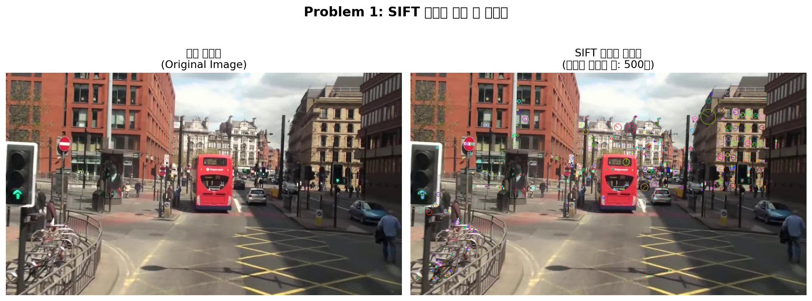

# Problem 1: SIFT를 이용한 특징점 검출 및 시각화

## 1. 과제 설명 (Description)

### 목표
`mot_color70.jpg` 이미지를 입력으로 받아 **SIFT(Scale-Invariant Feature Transform)** 알고리즘을 통해 특징점(Keypoint)을 검출하고, 이를 원본 이미지와 나란히 시각화합니다.

### 요구사항
| 요소 | 내용 |
|------|------|
| `cv.SIFT_create()` | SIFT 객체 생성 |
| `detectAndCompute()` | 특징점 검출 및 디스크립터 추출 |
| `cv.drawKeypoints()` | 특징점을 이미지에 시각화 |
| `matplotlib` | 원본 이미지와 시각화 이미지를 나란히 출력 |
| `DRAW_RICH_KEYPOINTS` flag | 특징점의 방향과 크기 표시 |

---

## 2. 핵심 로직 설명 (Core Logic)

### SIFT(Scale-Invariant Feature Transform) 알고리즘

SIFT는 이미지의 크기(Scale) 및 회전(Rotation)에 **불변(Invariant)** 한 특징점을 검출하는 알고리즘입니다.

```
[입력 이미지]
    ↓  Grayscale 변환
[가우시안 스케일 공간 구성]
    → 여러 해상도에서 DoG(Difference of Gaussian) 계산
    ↓
[극값(Local Extrema) 검출]
    → 스케일과 공간에서 최솟값/최댓값인 지점을 후보로 선정
    ↓
[Keypoint 정밀화 및 필터링]
    → 낮은 대비(contrast), 엣지 위의 불안정한 특징점 제거
    ↓
[방향(Orientation) 할당]
    → 특징점 주변 그래디언트로 주 방향 결정 (회전 불변성 부여)
    ↓
[128차원 디스크립터(Descriptor) 생성]
    → 특징점 주변 4×4 셀, 각 셀에서 8방향 히스토그램 = 128차원 벡터
```

### 매개변수 설명
- `nfeatures=500`: 최대 500개의 특징점만 검출 (응답값 기준 상위 N개 선택)
- `DRAW_RICH_KEYPOINTS`: 특징점을 **원(크기)** 과 **선(방향)** 으로 표현

---

## 3. 환경 설정 및 터미널 실행 방법 (How to Run)

### 가상환경 생성 및 활성화

#### 방법 A: Python venv (권장)
```bash
# 1. Problem_1 디렉토리로 이동
cd /path/to/4week/Problem_1

# 2. 가상환경 생성 (Python 3.9 이상 권장)
python3 -m venv .venv

# 3. 가상환경 활성화 (Linux/macOS)
source .venv/bin/activate

# 4. 필요 패키지 설치
pip install -r requirements.txt

# 5. 코드 실행
python problem1.py

# 6. 가상환경 비활성화 (종료 후)
deactivate
```

#### 방법 B: Conda
```bash
# 1. Conda 가상환경 생성 (Python 3.10)
conda create -n cv_hw python=3.10 -y

# 2. 환경 활성화
conda activate cv_hw

# 3. 패키지 설치
pip install -r requirements.txt

# 4. Problem_1 디렉토리로 이동 후 실행
cd /path/to/4week/Problem_1

### 예상 출력 (터미널)


---

## 4. 중간 결과 (Intermediate Results)

### 실행 과정

1. **이미지 로드**: `mot_color70.jpg` 읽기 → BGR에서 RGB/Grayscale로 변환
2. **SIFT 검출기 초기화**: `nfeatures=500`, `contrastThreshold=0.04`, `edgeThreshold=10`
3. **특징점 & 디스크립터 추출**: `detectAndCompute()` 호출

### 중간 결과 이미지

> 아래 이미지 플레이스홀더에 실행 후 캡처한 이미지를 삽입하세요.



---

## 5. 최종 결과 (Final Results)

### 검출 결과 요약

| 항목 | 내용 |
|------|------|
| 입력 이미지 | `mot_color70.jpg` |
| 검출 알고리즘 | SIFT (`cv.SIFT_create`) |
| 최대 특징점 수 | 500개 |
| 시각화 방식 | `DRAW_RICH_KEYPOINTS` (크기+방향 포함) |
| 저장 경로 | `output/problem1_result.png` |

### 분석
- SIFT는 이미지의 코너, 엣지, 텍스처가 풍부한 영역에서 특징점을 주로 검출합니다.
- `DRAW_RICH_KEYPOINTS` 플래그를 사용하면 각 특징점의 **스케일(원의 크기)** 과 **주 방향(원 내의 선)** 을 시각적으로 확인할 수 있습니다.
- `nfeatures` 값을 줄이면 응답값이 높은(품질 좋은) 특징점만 선별됩니다.


---

## 6. 전체 코드 (Full Source Code)

```python
"""
문제 1: SIFT를 이용한 특징점 검출 및 시각화
과목: 컴퓨터비전 L04 Local Feature - Homework
교수: 서정일 (동아대학교 컴퓨터AI공학부)
"""

import cv2 as cv          # OpenCV 라이브러리 - 컴퓨터비전 핵심 기능 제공
import matplotlib.pyplot as plt  # matplotlib - 이미지 시각화 출력을 위한 라이브러리
import os                 # os - 파일 경로 처리를 위한 표준 라이브러리

# 현재 스크립트 파일이 위치한 디렉토리의 절대 경로를 구함
script_dir = os.path.dirname(os.path.abspath(__file__))

# 과제에서 지정한 이미지 파일 경로를 조합
image_path = os.path.join(script_dir, '..', 'base', 'mot_color70.jpg')

# cv.imread(): 이미지를 BGR 형식으로 읽어들임
img_bgr = cv.imread(image_path)

if img_bgr is None:
    raise FileNotFoundError(f"이미지 파일을 찾을 수 없습니다: {image_path}")

# cv.cvtColor(): BGR → RGB 변환 (matplotlib은 RGB 형식으로 출력)
img_rgb = cv.cvtColor(img_bgr, cv.COLOR_BGR2RGB)

# cv.cvtColor(): BGR → Grayscale 변환 (SIFT는 그레이스케일 이미지에서 동작)
img_gray = cv.cvtColor(img_bgr, cv.COLOR_BGR2GRAY)

print(f"[정보] 이미지 로드 완료: {image_path}")
print(f"[정보] 이미지 크기 (H x W): {img_bgr.shape[:2]}")

# cv.SIFT_create(): SIFT 특징점 검출기 초기화
sift = cv.SIFT_create(
    nfeatures=500,          # 최대 특징점 수 제한
    nOctaveLayers=3,        # 옥타브당 레이어 수
    contrastThreshold=0.04, # 대비 임계값
    edgeThreshold=10,       # 엣지 임계값
    sigma=1.6               # 가우시안 블러 시그마 값
)

# detectAndCompute(): 특징점 검출과 디스크립터 추출 동시 수행
keypoints, descriptors = sift.detectAndCompute(img_gray, None)
print(f"[결과] 검출된 특징점 수: {len(keypoints)}개")

# cv.drawKeypoints(): 특징점을 이미지에 시각화
img_keypoints = cv.drawKeypoints(
    img_rgb,
    keypoints,
    None,
    flags=cv.DRAW_MATCHES_FLAGS_DRAW_RICH_KEYPOINTS  # 크기 및 방향 포함하여 그리기
)

# matplotlib으로 원본과 특징점 이미지를 나란히 출력
fig, axes = plt.subplots(1, 2, figsize=(14, 6))
fig.suptitle('Problem 1: SIFT 특징점 검출 및 시각화', fontsize=16, fontweight='bold')

axes[0].imshow(img_rgb)
axes[0].set_title('원본 이미지\n(Original Image)', fontsize=13)
axes[0].axis('off')

axes[1].imshow(img_keypoints)
axes[1].set_title(f'SIFT 특징점 시각화\n(검출된 특징점 수: {len(keypoints)}개)', fontsize=13)
axes[1].axis('off')

plt.tight_layout()

# 결과 저장
output_dir = os.path.join(script_dir, 'output')
os.makedirs(output_dir, exist_ok=True)
output_path = os.path.join(output_dir, 'problem1_result.png')
plt.savefig(output_path, dpi=150, bbox_inches='tight')
print(f"[저장] 결과 이미지가 저장되었습니다: {output_path}")

plt.show()

# 상위 10개 특징점 정보 출력
print("\n[특징점 상위 10개 정보]")
print(f"{'순번':<5} {'X좌표':>8} {'Y좌표':>8} {'크기':>8} {'방향(°)':>10} {'응답값':>12}")
print("-" * 55)
for i, kp in enumerate(keypoints[:10]):
    print(f"{i+1:<5} {kp.pt[0]:>8.1f} {kp.pt[1]:>8.1f} {kp.size:>8.1f} {kp.angle:>10.1f} {kp.response:>12.4f}")
```
