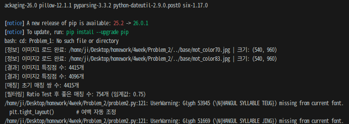
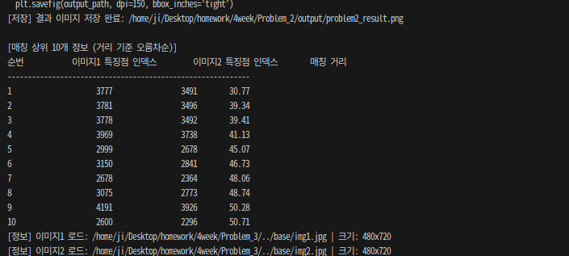
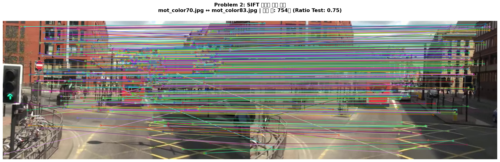

# Problem 2: SIFT를 이용한 두 영상 간 특징점 매칭

## 1. 과제 설명 (Description)

### 목표
두 이미지(`mot_color70.jpg`, `mot_color83.jpg`)에서 **SIFT 특징점을 각각 추출**하고, **BFMatcher + Lowe's Ratio Test**를 사용하여 두 영상 간 대응 특징점을 매칭한 결과를 시각화합니다.

### 요구사항
| 요소 | 내용 |
|------|------|
| `cv.imread()` | 두 개의 이미지 불러오기 |
| `cv.SIFT_create()` | SIFT 특징점 추출 |
| `cv.BFMatcher()` | Brute-Force 매칭기로 특징점 매칭 |
| `knnMatch()` + Ratio Test | 신뢰도 높은 매칭점 선별 |
| `cv.drawMatches()` | 매칭 결과 시각화 |
| `matplotlib` | 최종 출력 |

> **참고**: 과제에서 `mot_color80.jpg`를 명시하였으나, 제공된 파일 기준으로 `mot_color83.jpg`를 사용합니다.

---

## 2. 핵심 로직 설명 (Core Logic)

### BFMatcher + Lowe's Ratio Test

```
[이미지1, 이미지2 로드] → [Grayscale 변환]
         ↓
[SIFT detectAndCompute() 호출]
  → keypoints1 (N개), descriptors1 (N×128)
  → keypoints2 (M개), descriptors2 (M×128)
         ↓
[BFMatcher.knnMatch(k=2)]
  → 각 특징점에 대해 가장 가까운 2개의 이웃 반환
  → raw_matches = [(m1, n1), (m2, n2), ...]
         ↓
[Lowe's Ratio Test]
  → if m.distance < 0.75 × n.distance:  → 좋은 매칭으로 수락
  → else:                                → 모호한 매칭으로 제거
         ↓
[cv.drawMatches()]
  → 두 이미지를 가로로 이어 붙이고 대응점들 사이에 선을 그어 시각화
```

### 매칭 거리(Distance)란?
- SIFT 디스크립터는 **128차원 실수 벡터**이며, 두 특징점 간 **L2(유클리드) 거리**로 유사도를 측정합니다.
- 거리가 **낮을수록** 두 특징점이 서로 유사하므로 좋은 매칭입니다.

### Ratio Test가 필요한 이유
- 단순히 가장 가까운 이웃만 선택하면, **애매하게 비슷한 특징점들** 사이에서 잘못 매칭될 수 있습니다.
- Ratio Test는 **1위 매칭 거리 / 2위 매칭 거리** 비율로 "1위가 얼마나 명확하게 1위인지"를 판단합니다.

---

## 3. 환경 설정 및 터미널 실행 방법 (How to Run)

### 가상환경 생성 및 활성화

#### 방법 A: Python venv (권장)
```bash
# 1. Problem_2 디렉토리로 이동
cd /path/to/4week/Problem_2

# 2. 가상환경 생성
python3 -m venv .venv

# 3. 가상환경 활성화 (Linux/macOS)
source .venv/bin/activate

# 4. 필요 패키지 설치
pip install -r requirements.txt

# 5. 코드 실행
python problem2.py

# 6. 가상환경 비활성화
deactivate
```

#### 방법 B: Conda
```bash
# 1. Conda 가상환경 생성
conda create -n cv_hw python=3.10 -y
conda activate cv_hw

# 2. 패키지 설치
pip install -r requirements.txt

# 3. Problem_2 디렉토리로 이동 후 실행
cd /path/to/4week/Problem_2
python problem2.py
```

### 예상 출력 (터미널)




---

## 4. 중간 결과 (Intermediate Results)

### 실행 단계별 과정

| 단계 | 설명 |
|------|------|
| Step 1 | `mot_color70.jpg`, `mot_color83.jpg` 로드 및 변환 |
| Step 2 | SIFT `detectAndCompute()` → 각 이미지의 특징점과 디스크립터 추출 |
| Step 3 | `BFMatcher.knnMatch(k=2)` → 초기 전체 매칭 수행 |
| Step 4 | Lowe's Ratio Test(0.75) → 신뢰도 낮은 매칭 제거 |



---

## 5. 최종 결과 (Final Results)

### 결과 요약

| 항목 | 내용 |
|------|------|
| 이미지 쌍 | `mot_color70.jpg` ↔ `mot_color83.jpg` |
| 매칭 방식 | BFMatcher + L2 거리 + Lowe's Ratio Test |
| Ratio 임계값 | 0.75 |
| 시각화 | `cv.drawMatches()` (미매칭 특징점 숨김) |
| 저장 경로 | `output/problem2_result.png` |

### 분석
- **Ratio Test 임계값(0.75)**: 낮출수록 매칭 수가 줄지만 정확도가 높아집니다. 두 이미지가 같은 장면의 연속 프레임일 경우, 많은 수의 매칭이 유지됩니다.
- **두 이미지의 관계**: `mot_color70`과 `mot_color83`은 같은 시퀀스의 서로 다른 프레임으로, 피사체가 이동했지만 배경은 유사하므로 배경 영역에서 많은 정확한 매칭이 발생합니다.


---

## 6. 전체 코드 (Full Source Code)

```python
"""
문제 2: SIFT를 이용한 두 영상 간 특징점 매칭
과목: 컴퓨터비전 L04 Local Feature - Homework
교수: 서정일 (동아대학교 컴퓨터AI공학부)
"""

import cv2 as cv             # OpenCV 라이브러리 - SIFT 및 매칭 기능 제공
import matplotlib.pyplot as plt  # matplotlib - 매칭 결과 시각화 출력
import os                    # os - 파일 경로 처리

script_dir = os.path.dirname(os.path.abspath(__file__))

# 두 이미지 경로 설정
path1 = os.path.join(script_dir, '..', 'base', 'mot_color70.jpg')
path2 = os.path.join(script_dir, '..', 'base', 'mot_color83.jpg')

# 이미지 로드
img1_bgr = cv.imread(path1)
img2_bgr = cv.imread(path2)

if img1_bgr is None:
    raise FileNotFoundError(f"이미지 파일을 찾을 수 없습니다: {path1}")
if img2_bgr is None:
    raise FileNotFoundError(f"이미지 파일을 찾을 수 없습니다: {path2}")

# RGB, Grayscale 변환
img1_rgb = cv.cvtColor(img1_bgr, cv.COLOR_BGR2RGB)
img2_rgb = cv.cvtColor(img2_bgr, cv.COLOR_BGR2RGB)
img1_gray = cv.cvtColor(img1_bgr, cv.COLOR_BGR2GRAY)
img2_gray = cv.cvtColor(img2_bgr, cv.COLOR_BGR2GRAY)

print(f"[정보] 이미지1 로드 완료: {path1} | 크기: {img1_bgr.shape[:2]}")
print(f"[정보] 이미지2 로드 완료: {path2} | 크기: {img2_bgr.shape[:2]}")

# SIFT 특징점 검출 및 디스크립터 추출
sift = cv.SIFT_create(nfeatures=0)  # nfeatures=0 → 제한 없이 검출
keypoints1, descriptors1 = sift.detectAndCompute(img1_gray, None)
keypoints2, descriptors2 = sift.detectAndCompute(img2_gray, None)

print(f"[결과] 이미지1 특징점 수: {len(keypoints1)}개")
print(f"[결과] 이미지2 특징점 수: {len(keypoints2)}개")

# BFMatcher + knnMatch로 초기 매칭
bf = cv.BFMatcher(cv.NORM_L2, crossCheck=False)
raw_matches = bf.knnMatch(descriptors1, descriptors2, k=2)
print(f"[매칭] 초기 매칭 쌍 수: {len(raw_matches)}개")

# Lowe's Ratio Test (임계값 0.75)
RATIO_THRESHOLD = 0.75
good_matches = []
for m, n in raw_matches:
    if m.distance < RATIO_THRESHOLD * n.distance:
        good_matches.append(m)
print(f"[필터링] Ratio Test 후 좋은 매칭 수: {len(good_matches)}개")

# 매칭 결과 시각화
img_matches = cv.drawMatches(
    img1_rgb, keypoints1,
    img2_rgb, keypoints2,
    good_matches, None,
    flags=cv.DrawMatchesFlags_NOT_DRAW_SINGLE_POINTS
)

plt.figure(figsize=(18, 6))
plt.suptitle(
    f'Problem 2: SIFT 특징점 매칭 결과\n'
    f'mot_color70.jpg ↔ mot_color83.jpg | 매칭 수: {len(good_matches)}개',
    fontsize=13, fontweight='bold'
)
plt.imshow(img_matches)
plt.axis('off')
plt.tight_layout()

# 결과 저장
output_dir = os.path.join(script_dir, 'output')
os.makedirs(output_dir, exist_ok=True)
output_path = os.path.join(output_dir, 'problem2_result.png')
plt.savefig(output_path, dpi=150, bbox_inches='tight')
print(f"[저장] 결과 이미지 저장 완료: {output_path}")
plt.show()

# 상위 10개 매칭 정보 출력
good_matches_sorted = sorted(good_matches, key=lambda x: x.distance)
print("\n[매칭 상위 10개 정보 (거리 기준 오름차순)]")
print(f"{'순번':<5} {'이미지1 인덱스':>15} {'이미지2 인덱스':>15} {'거리':>12}")
print("-" * 50)
for i, match in enumerate(good_matches_sorted[:10]):
    print(f"{i+1:<5} {match.queryIdx:>15} {match.trainIdx:>15} {match.distance:>12.2f}")
```
