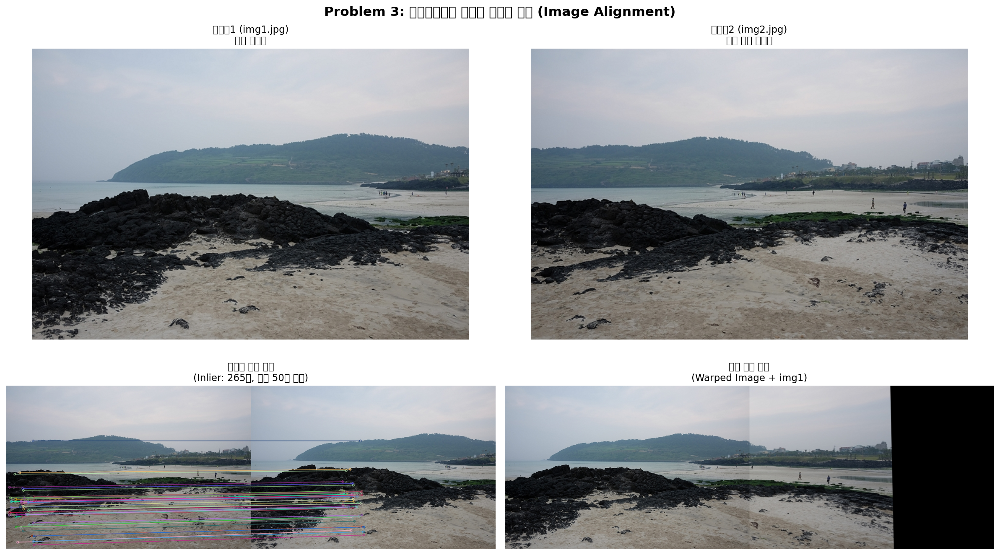

# Problem 3: 호모그래피를 이용한 이미지 정합 (Image Alignment)

## 1. 과제 설명 (Description)

### 목표
`img1.jpg`와 `img2.jpg` 두 이미지에서 SIFT 특징점을 검출하고, 대응점을 기반으로 **호모그래피(Homography) 행렬**을 계산합니다. 이를 활용하여 `cv.warpPerspective()`로 이미지를 변환 및 정렬하고, **변환 이미지(Warped Image)** 와 **특징점 매칭 결과** 를 나란히 시각화합니다.

### 요구사항
| 요소 | 내용 |
|------|------|
| `cv.imread()` | 두 이미지 불러오기 |
| `cv.SIFT_create()` | 특징점 검출 |
| `cv.BFMatcher()` + `knnMatch()` | 특징점 매칭 및 선별 |
| `cv.findHomography()` | 호모그래피 행렬 계산 (RANSAC) |
| `cv.warpPerspective()` | 한 이미지를 변환하여 다른 이미지와 정렬 |
| 출력 크기 | 파노라마 크기 `(w1+w2, max(h1,h2))` |

---

## 2. 핵심 로직 설명 (Core Logic)

### 호모그래피(Homography)란?
두 이미지 평면 사이의 **투영 변환(Projective Transformation)** 을 나타내는 3×3 행렬입니다. 같은 3D 장면을 서로 다른 시점(viewpoint)에서 촬영한 두 이미지 사이의 관계를 표현합니다.

```
                      [h11 h12 h13]
이미지2 좌표 → H × [h21 h22 h23] → 이미지1 좌표
                      [h31 h32 h33]
```

### 전체 파이프라인

```
[img1.jpg (기준), img2.jpg (변환 대상)] 로드
         ↓
[Grayscale 변환 → SIFT detectAndCompute()]
  → keypoints1, descriptors1 (이미지1)
  → keypoints2, descriptors2 (이미지2)
         ↓
[BFMatcher.knnMatch(k=2) + Lowe's Ratio Test(0.7)]
  → good_matches: 신뢰도 높은 대응점 선별
         ↓
[cv.findHomography(src_pts, dst_pts, cv.RANSAC, 5.0)]
  → H: 3×3 호모그래피 행렬 계산
  → mask: Inlier/Outlier 구분 마스크
         ↓
[cv.warpPerspective(img2, H, (w1+w2, max(h1,h2)))]
  → img2를 img1의 좌표계로 변환 (Warped Image)
         ↓
[Warped Image 위에 img1 합성]
  → 두 이미지가 정렬된 최종 결과
```

### RANSAC의 역할
- 매칭된 특징점 중에는 **잘못 매칭된 이상점(Outlier)** 이 포함될 수 있습니다.
- RANSAC은 랜덤하게 최소 샘플(4개 대응점)을 선택하여 호모그래피를 반복 계산하고, **가장 많은 inlier를 지지하는 호모그래피**를 최적 결과로 채택합니다.

---

## 3. 환경 설정 및 터미널 실행 방법 (How to Run)

### 가상환경 생성 및 활성화

#### 방법 A: Python venv (권장)
```bash
# 1. Problem_3 디렉토리로 이동
cd /path/to/4week/Problem_3

# 2. 가상환경 생성
python3 -m venv .venv

# 3. 가상환경 활성화 (Linux/macOS)
source .venv/bin/activate

# 4. 필요 패키지 설치
pip install -r requirements.txt

# 5. 코드 실행
python problem3.py

# 6. 가상환경 비활성화
deactivate
```

#### 방법 B: Conda
```bash
# 1. Conda 가상환경 생성 및 활성화
conda create -n cv_hw python=3.10 -y
conda activate cv_hw

# 2. 패키지 설치
pip install -r requirements.txt

# 3. 실행
cd /path/to/4week/Problem_3
python problem3.py
```

### 예상 출력 (터미널)


---

## 4. 중간 결과 (Intermediate Results)

### 단계별 처리 과정

| 단계 | 처리 내용 |
|------|----------|
| Step 1 | `img1.jpg`, `img2.jpg` 로드 → RGB/Grayscale 변환 |
| Step 2 | SIFT 특징점 검출 및 128차원 디스크립터 추출 |
| Step 3 | BFMatcher.knnMatch(k=2) → Lowe's Ratio Test(0.7) 적용 |
| Step 4 | `cv.findHomography(RANSAC)` → 3×3 호모그래피 행렬 계산 |
| Step 5 | `cv.warpPerspective()` → 이미지2를 이미지1에 정렬 |



---

## 5. 최종 결과 (Final Results)

### 결과 요약

| 항목 | 내용 |
|------|------|
| 이미지 쌍 | `img1.jpg` (기준) ↔ `img2.jpg` (변환 대상) |
| 매칭 방식 | BFMatcher + Lowe's Ratio Test (0.7) |
| 호모그래피 | `cv.findHomography()` + RANSAC (허용 오차 5.0px) |
| 변환 방식 | `cv.warpPerspective()` |
| 출력 크기 | `(w1+w2) × max(h1, h2)` 파노라마 크기 |
| 저장 파일 | `output/problem3_result.png`, `output/problem3_warped.png`, `output/problem3_aligned.png` |

### 분석
- **Inlier 비율이 높을수록** 호모그래피의 정확도가 높습니다 (일반적으로 80% 이상이면 좋은 매칭).
- **`warpPerspective()`의 출력 크기**를 `(w1+w2, max(h1,h2))`로 설정하면 두 이미지가 나란히 정렬된 파노라마 형태의 결과를 얻을 수 있습니다.
- RANSAC 허용 오차(5.0px)를 줄이면 더 엄격한 Inlier 기준이 적용됩니다.


---

## 6. 전체 코드 (Full Source Code)

```python
"""
문제 3: 호모그래피를 이용한 이미지 정합 (Image Alignment)
과목: 컴퓨터비전 L04 Local Feature - Homework
교수: 서정일 (동아대학교 컴퓨터AI공학부)
"""

import cv2 as cv              # OpenCV - SIFT, 호모그래피, 원근 변환 기능 제공
import numpy as np            # NumPy - 행렬 연산 및 이미지 배열 처리
import matplotlib.pyplot as plt  # matplotlib - 최종 결과 시각화
import os                     # os - 파일 경로 처리

script_dir = os.path.dirname(os.path.abspath(__file__))

# 두 이미지 경로 설정
path1 = os.path.join(script_dir, '..', 'base', 'img1.jpg')
path2 = os.path.join(script_dir, '..', 'base', 'img2.jpg')

# 이미지 로드
img1_bgr = cv.imread(path1)
img2_bgr = cv.imread(path2)

if img1_bgr is None:
    raise FileNotFoundError(f"이미지 파일을 찾을 수 없습니다: {path1}")
if img2_bgr is None:
    raise FileNotFoundError(f"이미지 파일을 찾을 수 없습니다: {path2}")

# RGB, Grayscale 변환
img1_rgb = cv.cvtColor(img1_bgr, cv.COLOR_BGR2RGB)
img2_rgb = cv.cvtColor(img2_bgr, cv.COLOR_BGR2RGB)
img1_gray = cv.cvtColor(img1_bgr, cv.COLOR_BGR2GRAY)
img2_gray = cv.cvtColor(img2_bgr, cv.COLOR_BGR2GRAY)

h1, w1 = img1_bgr.shape[:2]
h2, w2 = img2_bgr.shape[:2]

print(f"[정보] 이미지1 로드: {path1} | 크기: {h1}x{w1}")
print(f"[정보] 이미지2 로드: {path2} | 크기: {h2}x{w2}")

# SIFT 특징점 검출
sift = cv.SIFT_create(nfeatures=0)
keypoints1, descriptors1 = sift.detectAndCompute(img1_gray, None)
keypoints2, descriptors2 = sift.detectAndCompute(img2_gray, None)

print(f"[SIFT] 이미지1 특징점 수: {len(keypoints1)}개")
print(f"[SIFT] 이미지2 특징점 수: {len(keypoints2)}개")

# BFMatcher + knnMatch + Lowe's Ratio Test (0.7)
bf = cv.BFMatcher(cv.NORM_L2, crossCheck=False)
raw_matches = bf.knnMatch(descriptors2, descriptors1, k=2)

RATIO_THRESHOLD = 0.7
good_matches = []
for m, n in raw_matches:
    if m.distance < RATIO_THRESHOLD * n.distance:
        good_matches.append(m)

print(f"[매칭] Ratio Test 통과 매칭 수: {len(good_matches)}개 (임계값: {RATIO_THRESHOLD})")

if len(good_matches) < 4:
    raise ValueError(f"매칭 수({len(good_matches)})가 너무 적습니다.")

# 호모그래피 행렬 계산 (RANSAC)
src_pts = np.float32([keypoints2[m.queryIdx].pt for m in good_matches]).reshape(-1, 1, 2)
dst_pts = np.float32([keypoints1[m.trainIdx].pt for m in good_matches]).reshape(-1, 1, 2)

H, mask = cv.findHomography(src_pts, dst_pts, cv.RANSAC, 5.0)
inliers = int(mask.sum())
print(f"[호모그래피] 계산 완료 | Inlier: {inliers}개")
print(f"[호모그래피 행렬 H]:\n{H}")

# 원근 변환 적용
out_w = w1 + w2
out_h = max(h1, h2)
warped_img2 = cv.warpPerspective(img2_bgr, H, (out_w, out_h))
result_bgr = warped_img2.copy()
result_bgr[0:h1, 0:w1] = img1_bgr

warped_rgb = cv.cvtColor(warped_img2, cv.COLOR_BGR2RGB)
result_rgb = cv.cvtColor(result_bgr, cv.COLOR_BGR2RGB)
print("[정합] 이미지 변환 및 합성 완료")

# Inlier 매칭 시각화
inlier_matches = [good_matches[i] for i in range(len(good_matches)) if mask.ravel()[i] == 1]
img_matches_vis = cv.drawMatches(
    img2_rgb, keypoints2, img1_rgb, keypoints1,
    inlier_matches[:50], None,
    flags=cv.DrawMatchesFlags_NOT_DRAW_SINGLE_POINTS
)

# matplotlib 2×2 레이아웃으로 시각화
fig, axes = plt.subplots(2, 2, figsize=(16, 10))
fig.suptitle('Problem 3: 호모그래피를 이용한 이미지 정합', fontsize=15, fontweight='bold')

axes[0, 0].imshow(img1_rgb)
axes[0, 0].set_title('이미지1 (img1.jpg)\n기준 이미지', fontsize=11)
axes[0, 0].axis('off')

axes[0, 1].imshow(img2_rgb)
axes[0, 1].set_title('이미지2 (img2.jpg)\n변환 대상 이미지', fontsize=11)
axes[0, 1].axis('off')

axes[1, 0].imshow(img_matches_vis)
axes[1, 0].set_title(f'특징점 매칭 결과\n(Inlier: {inliers}개)', fontsize=11)
axes[1, 0].axis('off')

axes[1, 1].imshow(result_rgb)
axes[1, 1].set_title('최종 정합 결과\n(Warped Image + img1)', fontsize=11)
axes[1, 1].axis('off')

plt.tight_layout()

# 결과 저장
output_dir = os.path.join(script_dir, 'output')
os.makedirs(output_dir, exist_ok=True)

plt.savefig(os.path.join(output_dir, 'problem3_result.png'), dpi=150, bbox_inches='tight')
cv.imwrite(os.path.join(output_dir, 'problem3_warped.png'), warped_img2)
cv.imwrite(os.path.join(output_dir, 'problem3_aligned.png'), result_bgr)

print(f"[저장] 결과 이미지 저장 완료: {output_dir}/")
plt.show()
```
